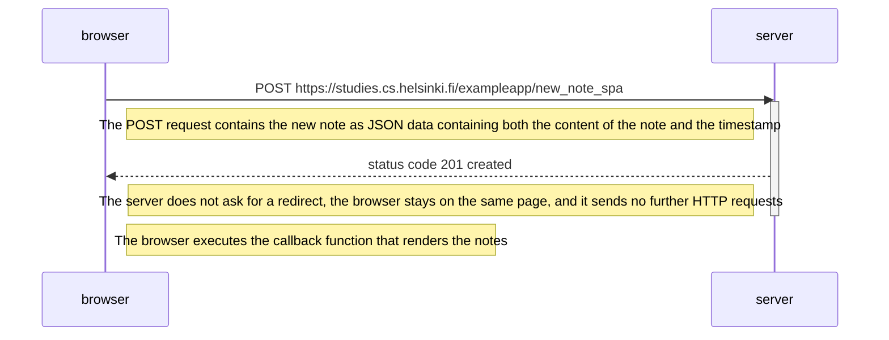

```mermaid
sequenceDiagram
    participant browser
    participant server

    browser->>server: POST https://studies.cs.helsinki.fi/exampleapp/new_note_spa
    activate server
    Note right of browser: The POST request contains the new note as JSON data containing both the content of the note and the timestamp
    server-->>browser: status code 201 created
    Note left of server: The server does not ask for a redirect, the browser stays on the same page, and it sends no further HTTP requests
    deactivate server

    Note right of browser: The browser executes the callback function that renders the notes
```